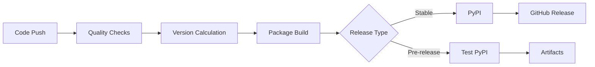

# GitHub Actions Workflows

This document describes the automated CI/CD workflows for the easecloud-errica package.

## Overview

The package uses three main workflows for automated testing, building, and publishing:

1. **`test.yml`** - Continuous testing on multiple platforms
2. **`publish.yml`** - Automated package publishing 
3. **`release.yml`** - Manual release creation

## Workflow Details

### 1. Test Workflow (`test.yml`)

**Purpose**: Ensure code quality and compatibility across environments

**Triggers:**
- Pull requests to main branch
- Pushes to main (when code changes)
- Manual dispatch

**Test Matrix:**
- **Python versions**: 3.8, 3.9, 3.10, 3.11, 3.12
- **Operating systems**: Ubuntu, Windows, macOS

**What it tests:**
```yaml
✅ Package import
✅ Basic functionality
✅ Example scripts execution
✅ Package building
✅ Cross-platform compatibility
```

**Example run:**
```bash
# Automatically runs these tests:
python -c "import easecloud_errica; print('Import works!')"
python examples/basic_usage.py
python -m build
```

### 2. Publish Workflow (`publish.yml`)

**Purpose**: Automatically build and publish packages based on git activity

**Triggers:**
- **Main branch push** → Dev release
- **Release branch push** (`release/**`) → Beta release  
- **GitHub release** → Stable release
- **Manual dispatch** → Custom release

**Version Strategy:**
```bash
# Development builds (from main)
0.1.0-dev.123+a1b2c3d → Test PyPI

# Beta releases (from release/v* branches)  
0.1.0-beta.1 → Test PyPI

# Stable releases (from GitHub releases)
1.0.0 → PyPI
```

**Publishing Flow:**


**Quality Gates:**
- All tests must pass
- Package must build successfully
- Version validation
- Cross-platform compatibility

### 3. Release Workflow (`release.yml`)

**Purpose**: Manual creation of proper releases with version management

**Triggers:**
- Manual dispatch only (GitHub Actions UI)

**Inputs:**
- **Version**: e.g., `1.0.0`, `1.0.0-beta.1`
- **Release type**: stable, beta, alpha, rc
- **Pre-release flag**: Mark as pre-release

**What it does:**
1. **Validates** version format
2. **Updates** `pyproject.toml` and `__init__.py`
3. **Creates** git tag (`v1.0.0`)
4. **Generates** changelog from commits
5. **Creates** GitHub release
6. **Triggers** publish workflow

**Example workflow:**
```bash
# 1. Go to Actions → "Create Release"
# 2. Enter: version=1.0.0, type=stable
# 3. Workflow automatically:
git commit -m "chore: bump version to 1.0.0"
git tag v1.0.0
git push && git push --tags
# 4. Creates GitHub release
# 5. Triggers automatic PyPI publish
```

## Version Management

### Semantic Versioning

We follow [SemVer](https://semver.org/) with extensions for pre-releases:

```bash
# Stable releases
1.0.0           # Major.Minor.Patch
1.1.0           # New features (backward compatible)  
1.0.1           # Bug fixes

# Pre-releases
1.0.0-alpha.1   # Alpha release
1.0.0-beta.1    # Beta release
1.0.0-rc.1      # Release candidate

# Development builds  
1.0.0-dev.123+sha  # Auto-generated from main
```

### Version Calculation

The publish workflow automatically calculates versions:

```bash
# Base version from pyproject.toml
BASE_VERSION="0.1.0"

# Commit count since last tag
COMMIT_COUNT=$(git rev-list --count HEAD)

# Short commit SHA
SHORT_SHA=$(git rev-parse --short HEAD)

# Examples:
# Dev: 0.1.0-dev.45+a1b2c3d
# Beta: 0.1.0-beta.45  
# Stable: 1.0.0 (from tag)
```

## Setup Requirements

### 1. PyPI API Tokens

Create API tokens and add as GitHub secrets:

**PyPI (for stable releases):**
1. Go to https://pypi.org/manage/account/token/
2. Create token with "Entire account" scope
3. Add as secret: `PYPI_API_TOKEN`

**Test PyPI (for dev/beta releases):**
1. Go to https://test.pypi.org/manage/account/token/
2. Create token with "Entire account" scope  
3. Add as secret: `TEST_PYPI_API_TOKEN`

### 2. GitHub Environments (Optional)

Create environments for additional protection:

```yaml
# .github/environments/production.yml
name: production
deployment_protection_rules:
  - type: required_reviewers
    required_reviewers: ["maintainer-username"]
```

### 3. Branch Protection

Recommended main branch protection:
- ✅ Require pull request reviews
- ✅ Require status checks (test workflow)
- ✅ Require up-to-date branches
- ✅ Include administrators

## Usage Examples

### Development Workflow

```bash
# 1. Create feature branch
git checkout -b feature/new-channel

# 2. Make changes and test locally
pytest tests/
python examples/basic_usage.py

# 3. Push and create PR
git push origin feature/new-channel
# Creates PR → triggers test workflow

# 4. Merge to main
# Automatically publishes dev build to Test PyPI
```

### Beta Release Workflow

```bash
# 1. Create release branch
git checkout -b release/v1.0.0-beta
git push origin release/v1.0.0-beta

# 2. Automatic beta publish
# Version: 1.0.0-beta.X → Test PyPI

# 3. Test beta version
pip install -i https://test.pypi.org/simple/ easecloud-errica
```

### Stable Release Workflow

```bash
# 1. Use release workflow
# Actions → "Create Release" → version: "1.0.0"

# 2. Automatic process:
# - Updates version files
# - Creates git tag v1.0.0  
# - Creates GitHub release
# - Publishes to PyPI

# 3. Verify release
pip install easecloud-errica==1.0.0
```

## Monitoring and Troubleshooting

### Workflow Status

Monitor workflows in the Actions tab:
- ✅ Green: All checks passed
- ❌ Red: Failures (click for details)
- 🟡 Yellow: In progress

### Common Issues

**1. PyPI Token Expired:**
```bash
Error: Invalid or expired token
Solution: Update PYPI_API_TOKEN secret
```

**2. Version Already Exists:**
```bash
Error: File already exists
Solution: Use a different version number
```

**3. Test Failures:**
```bash
Error: Tests failed on Python 3.12
Solution: Check logs, fix compatibility issues
```

**4. Build Failures:**
```bash
Error: Package build failed
Solution: Check pyproject.toml syntax
```

### Manual Override

If workflows fail, you can publish manually:

```bash
# 1. Build package
python -m build

# 2. Upload to Test PyPI
twine upload --repository testpypi dist/*

# 3. Upload to PyPI  
twine upload dist/*
```

### Debugging Workflows

**View detailed logs:**
1. Go to Actions tab
2. Click on failed workflow
3. Click on failed job
4. Expand log sections

**Test workflow locally:**
```bash
# Install act (GitHub Actions local runner)
curl https://raw.githubusercontent.com/nektos/act/master/install.sh | sudo bash

# Run workflow locally
act -j test
```

## Security Considerations

### Token Security
- Use minimal scope tokens
- Rotate tokens regularly
- Monitor token usage in PyPI

### Workflow Security  
- Pin action versions (`@v4` not `@main`)
- Use environment protection for production
- Review dependency updates from Dependabot

### Package Security
- Sign releases (future enhancement)
- Use provenance attestation
- Regular security scans

## Future Enhancements

Planned workflow improvements:

- [ ] **Security scanning** with CodeQL
- [ ] **Dependency vulnerability scanning**
- [ ] **Performance benchmarking**
- [ ] **Documentation building** and deployment
- [ ] **Release notes automation**
- [ ] **Slack/Discord notifications**
- [ ] **Package signing** with sigstore

## Support

For workflow-related issues:
- **GitHub Issues**: https://github.com/easecloudio/easecloud-errica/issues
- **Workflow logs**: Check Actions tab for detailed information
- **Documentation**: This file and `.github/README.md`